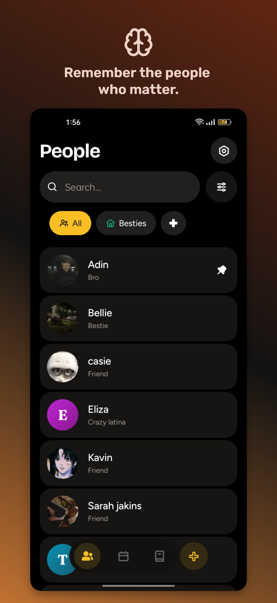
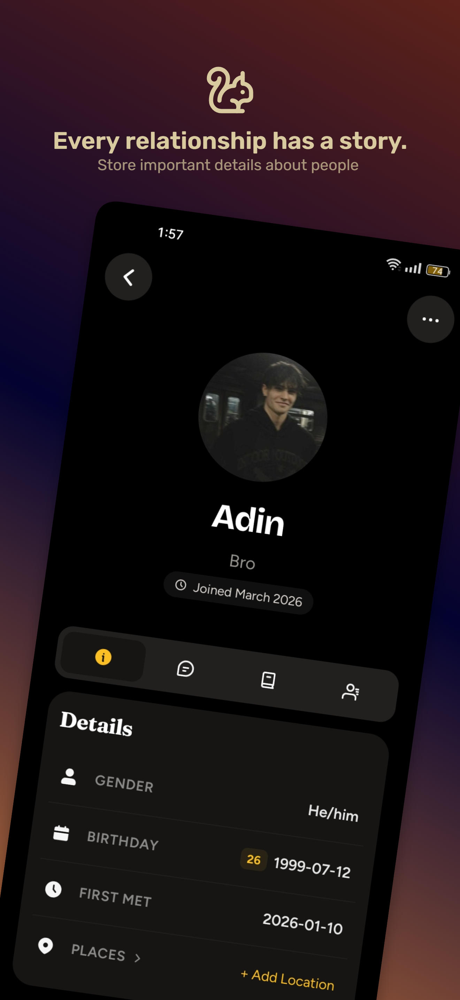
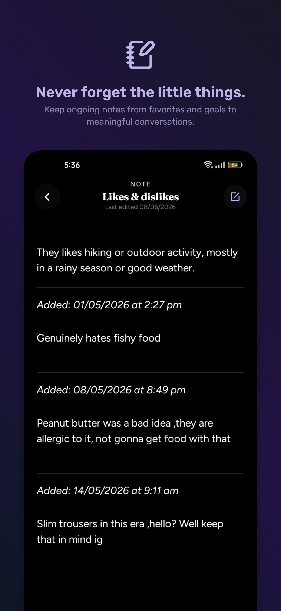
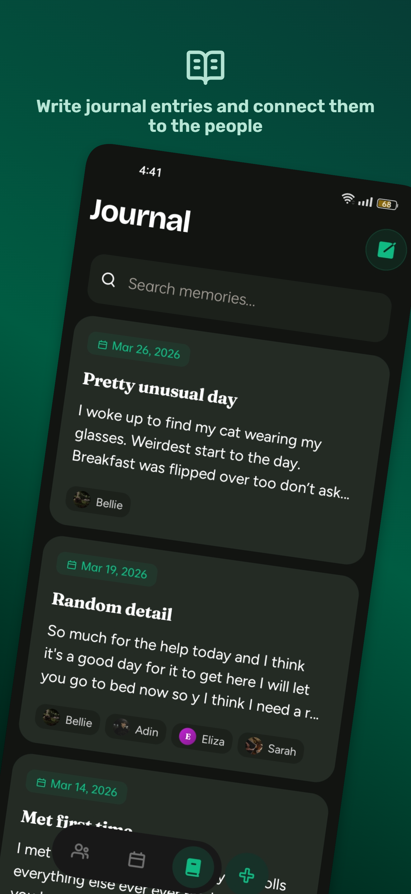
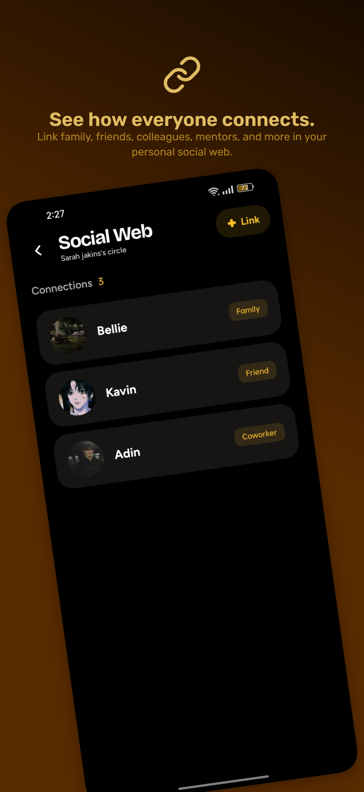
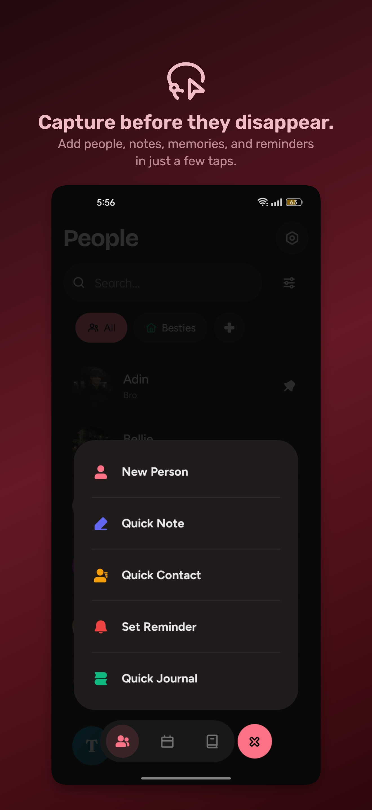
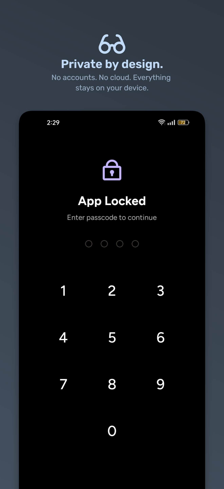

<div align="center">
 
 <h1>Reloom</h1>
 <p>People notes, journal and contacts. A private social registry built for networking and remembering.</p>
</div>

<br />

Reloom is more than a contact book, it's a personal registry built to capture the context often lost in a generic list. It is designed for those who want to remember the details about people, manage different contacts, and journal alongside.

The core of Reloom is a frictionless workflow that lets you log information on the go and find it exactly when you need it. Every interaction and note is stored in a secure, local vault on your device, keeping your data private and your network organized.

---

## Screenshots

       

---

## Features

### Privacy & Data Ownership
- **Local-First:** Your data lives on your device. No accounts, no cloud sync, no servers.
- **App Lock:** Protect access with a PIN or your device's biometrics (Face ID / fingerprint).
- **Portable Backups:** Export your entire registry and move it to another device whenever you want.

### People & Relationships
- **The Social Web:** See how everyone connects. Relationships are bi-directional, linking people on one profile shows up on both.
- **Communication Hub:** Store phone numbers, emails, and social handles. One tap opens WhatsApp, Instagram, LinkedIn, or your native phone and email apps.
- **Places:** Attach home, work, or other addresses to people. Tap any address to open it directly in your maps app.
- **Groups:** Organize your network into custom groups, Family, Work, Music ,each with its own color and icon for fast filtering.

### Notes & Journaling
- **Capture Quickly:** Add notes to anyone's profile in seconds. Drafts are saved automatically as you type.
- **Semantic Categories:** Tag entries as Memories, Goals, Food & Drink, and more, so your journal feels organized without feeling like work.
- **Tag People:** Mention anyone in your journal. A smart picker surfaces the people you write about most.
- **Markdown Support:** Write with blockquotes, bold, italics, inline code, and checkboxes all work as expected.
- **Smart Templates:** The tags and categories you use most rise to the top. The ones you don't use fade away.

### Calendar & Reminders
- **Unified Timeline:** Birthdays and reminders live together in one calendar view.
- **Context-Aware Adding:** Tap a past date to write a journal entry. Tap a future date to set a reminder.
- **Contact-Linked Reminders:** Attach reminders to people. Tapping the reminder takes you straight to their profile.
- **Smart Suggestions:** When you link a person to a reminder, the picker surfaces the contacts you interact with most.

### 🎨 Designed to Feel Good
- **Warm, Thoughtful Visuals:** Reloom uses a soft, layered palettes with different themes preset available.
- **Multiple Themes:** Choose from five complete color schemes, each with a light and dark mode.
- **Smooth & Responsive:** Every interaction carries a subtle, physical feedback , from button presses to list transitions.

### Dashboard
- **At a Glance option :** Your homescreen shows groups, upcoming birthdays, and people worth reconnecting with ,all surfaced quietly, without demanding attention.
- **Fast Add:** Jump straight into creating a person, note, or reminder without navigating through menus.

### Flexible & Controlled
- **Quick Actions:** A single floating button gives you instant access to the three things you do most: add a person, write a note, or set a reminder.
- **Choose Your Layout:** Reorder profile tabs or turn off entire modules (like Journal or Calendar) if you don't need them.
- **Works Offline:** No internet required. Everything is available the moment you open the app.

## Technical Foundation

- **Core:** Built with React Native and Expo for a native mobile experience.
- **Database:** Type-safe local storage with automated migrations.
- **Routing:** File-based navigation.
- **Motion:** Spring-based animations for a responsive, tactile feel.

## Getting Started

To run Reloom locally for development:

```bash
cd Reloom
npm install
npx expo start
```

## Contributions

This project is a personal project and is not currently open to external contributions. Pull requests will be closed without review.

## License & Privacy

Reloom is open-source under the [AGPL-3.0 License](./LICENSE). Check [Privacy Policy](./PRIVACY.md).
